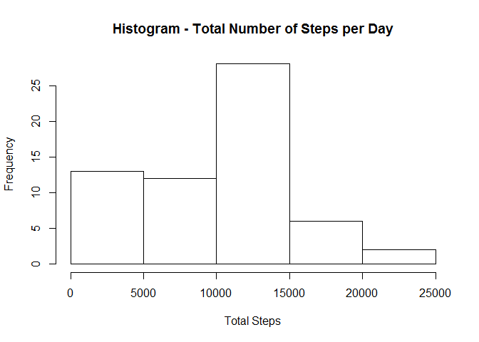
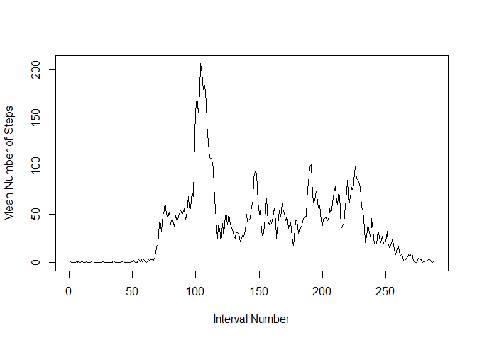
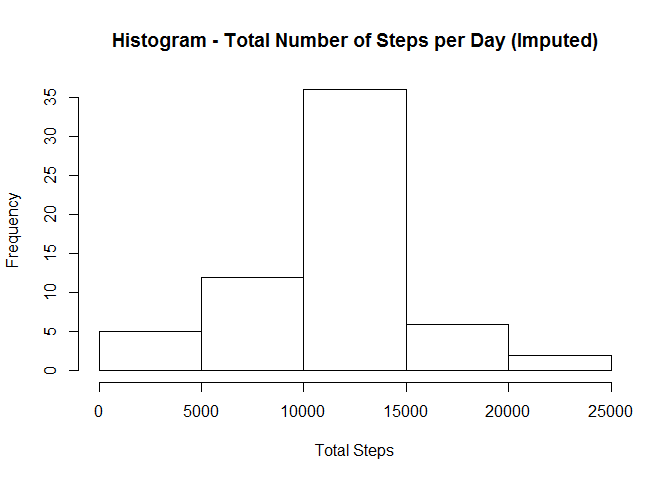
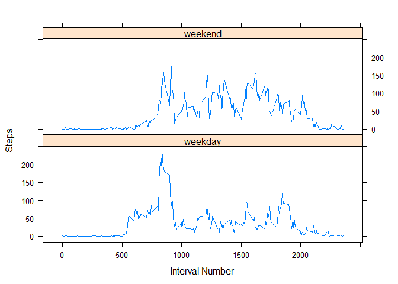

# Reproducible Research: Peer Assessment 1
  
## Loading and preprocessing the data
  
  
It is assumed that the reader has loaded the data file into the current working directory  

1. Load the data


```r
activity <- read.csv("activity.csv", stringsAsFactors=FALSE)
```

2. Format the date column

```r
activity$date <- as.POSIXct(activity$date, format="%Y-%m-%d")
```

3. View the first few rows of the data

```r
head(activity)
```

```
##   steps       date interval
## 1    NA 2012-10-01        0
## 2    NA 2012-10-01        5
## 3    NA 2012-10-01       10
## 4    NA 2012-10-01       15
## 5    NA 2012-10-01       20
## 6    NA 2012-10-01       25
```


## What is mean total number of steps taken per day?

1. Calculate the total number of steps taken per day

```r
totalByDay <-aggregate(activity$steps, by=list(activity$date), FUN=sum, na.rm=TRUE)
```

2. Make a histogram of the total number of steps taken each day

```r
hist(totalByDay$x, xlab="Total Steps", main="Histogram - Total Number of Steps per Day")
```

 

3. Calculate and report the mean and median of the total number of steps taken per day

```r
#Mean
mean(totalByDay$x)
```

```
## [1] 9354.23
```

```r
#Median
median(totalByDay$x)
```

```
## [1] 10395
```


## What is the average daily activity pattern?

1. Make a time series plot of the interval and the average number of steps taken

```r
meanByInterval <-aggregate(activity$steps, by=list(activity$interval), FUN=mean, na.rm=TRUE)
plot(meanByInterval$x, type="l", xlab="Interval Number", ylab="Mean Number of Steps")
```

 

2. Which 5-minute interval, on average across all the days in the dataset, contains the maximum number of steps?

```r
maxInterval <- which.max(meanByInterval$x)
maxInterval
```

```
## [1] 104
```

## Imputing missing values

1. Calculate and report the total number of missing values in the dataset

```r
#View the summary of the data to see there are 2,304 missing values
summary(activity)
```

```
##      steps             date                        interval     
##  Min.   :  0.00   Min.   :2012-10-01 00:00:00   Min.   :   0.0  
##  1st Qu.:  0.00   1st Qu.:2012-10-16 00:00:00   1st Qu.: 588.8  
##  Median :  0.00   Median :2012-10-31 00:00:00   Median :1177.5  
##  Mean   : 37.38   Mean   :2012-10-31 00:25:34   Mean   :1177.5  
##  3rd Qu.: 12.00   3rd Qu.:2012-11-15 00:00:00   3rd Qu.:1766.2  
##  Max.   :806.00   Max.   :2012-11-30 00:00:00   Max.   :2355.0  
##  NA's   :2304
```

2. Devise a strategy for filling in all of the missing values in the dataset.  
The strategy is to utilize the mean for the entire dataset as the imputed value

3. Create a new dataset that is equal to the original dataset but with the missing data filled in.

```r
require(Hmisc)
```

```
## Loading required package: Hmisc
```

```
## Warning: package 'Hmisc' was built under R version 3.1.3
```

```
## Loading required package: grid
## Loading required package: lattice
## Loading required package: survival
## Loading required package: splines
## Loading required package: Formula
```

```
## Warning: package 'Formula' was built under R version 3.1.3
```

```
## Loading required package: ggplot2
## 
## Attaching package: 'Hmisc'
## 
## The following objects are masked from 'package:base':
## 
##     format.pval, round.POSIXt, trunc.POSIXt, units
```

```r
imputedActivity <- activity
imputedActivity$steps <- with(imputedActivity, impute(steps, mean))
```

4a. Make a histogram of the total number of steps taken each day

```r
imputedTotalByDay <-aggregate(imputedActivity$steps, by=list(imputedActivity$date), FUN=sum)
hist(imputedTotalByDay$x, xlab="Total Steps", main="Histogram - Total Number of Steps per Day (Imputed)")
```

 

4b. Calculate and report the mean and median total number of steps taken per day.

```r
#Mean - imputed
mean(imputedTotalByDay$x)
```

```
## [1] 10766.19
```

```r
#Median - imputed
median(imputedTotalByDay$x)
```

```
## [1] 10766.19
```

4c. Do these values differ from the estimates from the first part of the assignment?  
Yes - these values differ from the estimates from the first part of the assignment.

4d. What is the impact of imputing missing data on the estimates of the total daily number of steps?  
The mean and median both increase as a result of imputing missing data based on this strategy.


## Are there differences in activity patterns between weekdays and weekends?

1. Create a new factor variable in the dataset with two levels - "weekday" and "weekend"

```r
activityCompare <- data.frame(date=activity$date, dayofweek=tolower(weekdays(activity$date)), 
                              steps=activity$steps, interval=activity$interval)
weekdays <- c("Monday", "Tuesday", "Wednesday", "Thursday","Friday")
activityCompare$dayType = as.factor(ifelse(is.element(weekdays(as.Date(activityCompare$date)),weekdays), "weekday", "weekend"))
```

2. Make a panel plot containing a time series plot of the interval and the average number of steps taken, averaged across all weekday days or weekend days.

```r
activityCompareDayType <- aggregate(steps ~ interval + dayType, activityCompare, mean)
library(lattice)
xyplot(activityCompareDayType$steps ~ activityCompareDayType$interval | activityCompareDayType$dayType, 
       type="l", layout=c(1,2), xlab="Interval Number", ylab="Steps")
```

 
